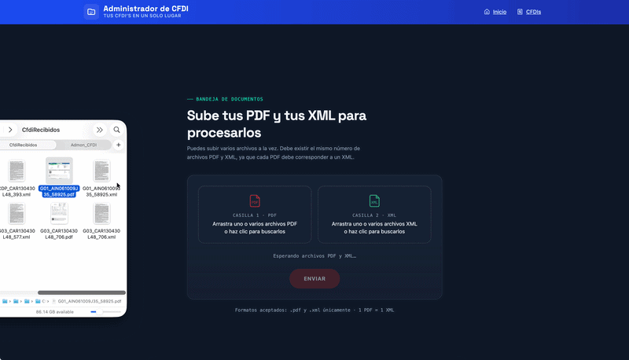
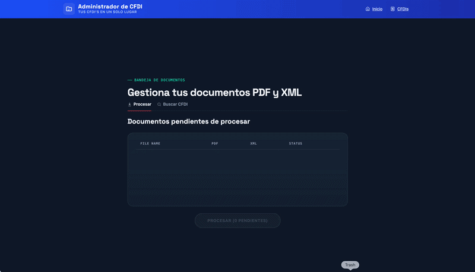
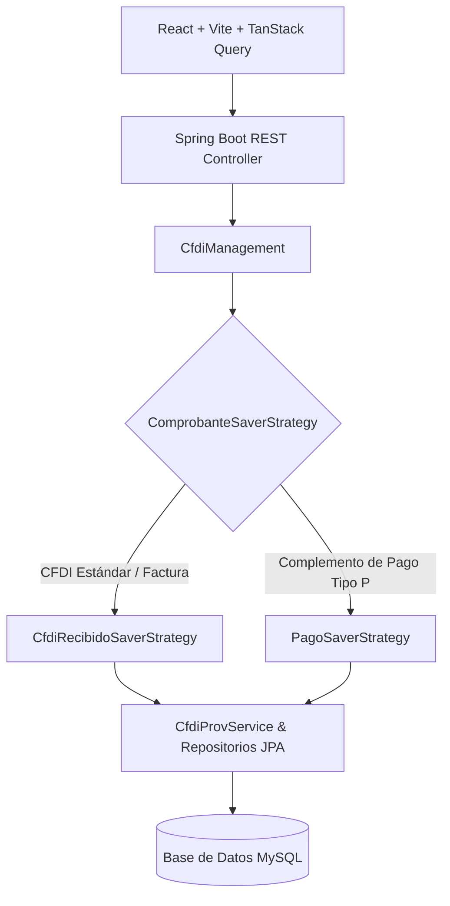

<div align="center">

# 📑 CFDI Admin

**Plataforma web full-stack moderna para el procesamiento, organización y consulta de Comprobantes Fiscales Digitales por Internet (CFDI 4.0) mexicanos.**

[](#) [](https://openjdk.org/projects/jdk/17/) [](https://spring.io/projects/spring-boot) [](https://react.dev/) [](https://www.typescriptlang.org/)
[](https://vitejs.dev/) [](https://tanstack.com/query) [](https://www.mysql.com/) [](LICENSE.md)

<p align="center">
  🇺🇸 <b><a href="README.md">Read this documentation in English</a></b>
</p>

---

<p align="center">
  <a href="#acerca-del-proyecto">Acerca de</a> •
  <a href="#demo--capturas-de-pantalla">Capturas</a> •
  <a href="#stack-tecnológico">Stack Tecnológico</a> •
  <a href="#arquitectura-y-decisiones-de-ingeniería">Arquitectura</a> •
  <a href="#características">Características</a> •
  <a href="#instalación-y-uso">Instalación</a> •
  <a href="#roadmap">Roadmap</a> •
  <a href="#licencia">Licencia</a> •
  <a href="#autor">Autor</a>
</p>

</div>

---

## 📌 Acerca del Proyecto

En México, el **CFDI** (*Comprobante Fiscal Digital por Internet*) es el estándar oficial y obligatorio de facturación electrónica regulado por el Servicio de Administración Tributaria (**SAT**). Cada transacción comercial genera archivos XML estandarizados acompañados de su representación impresa en PDF, abarcando tanto comprobantes ordinarios de ingresos/egresos como recibos de pago (*Complemento de Recepción de Pagos*).

La administración y control de grandes volúmenes de archivos CFDI suele ser un proceso propenso a errores y tedioso para áreas contables y administrativas. **CFDI Admin** resuelve esta problemática ofreciendo una solución full-stack automatizada y resiliente para procesar, parsear, validar, clasificar y consultar comprobantes CFDI 4.0 de forma eficiente.

> 🚀 **Aspecto Destacado de Ingeniería:** El proyecto fue completamente refactorizado y rediseñado, migrando de un monolito legado renderizado en servidor con Thymeleaf hacia una arquitectura moderna desacoplada basada en una **API REST en Java 17 / Spring Boot** y una **SPA reactiva en React + TypeScript**.

---

## 📸 Demo / Capturas de Pantalla

<div align="center">

### Panel Principal (Carga y Procesamiento)
*Carga de archivos drag-and-drop, visualización de documentos pendientes y estado de ejecución por lotes.*



<br/>

### Explorador y Búsqueda de Comprobantes
*Consultas multicriterio (por fecha de comprobante, fecha de procesamiento y RFC/Emisor) con vista interactiva en tabla.*



</div>

---

## 🛠 Stack Tecnológico

### Backend
| Tecnología | Rol | Justificación Técnica |
| :--- | :--- | :--- |
| **Java 17** | Plataforma Base | Versión LTS con rendimiento optimizado, fuerte encapsulamiento y características modernas del lenguaje como Records y mejoras en Stream API. |
| **Spring Boot 3** | Framework de Aplicación | Robusta inyección de dependencias, manejo transaccional declarativo y capa de controladores RESTful desacoplada. |
| **Spring Data JPA / Hibernate** | ORM y Persistencia | Abstracción de acceso a datos declarativa y optimización de consultas en repositorios. |
| **MySQL 8** | Base de Datos Relacional | Almacenamiento transaccional confiable con soporte de índices para metadatos fiscales y consultas temporales. |

### Frontend
| Tecnología | Rol | Justificación Técnica |
| :--- | :--- | :--- |
| **React 19** | Biblioteca de UI | Arquitectura declarativa basada en componentes para interfaces de usuario modulares y reactivas. |
| **TypeScript** | Lenguaje | Tipado estático de extremo a extremo, prevención de errores en tiempo de compilación y contratos estrictos con los DTOs del backend. |
| **Vite** | Herramienta de Construcción | Hot Module Replacement (HMR) instantáneo y compilaciones optimizadas para producción con esbuild. |
| **TanStack Query (React Query v5)** | Gestión de Server State | Gestión profesional de caché, sincronización en segundo plano, revalidación automática y control de estados de carga/error. |
| **Axios** | Cliente HTTP | Cliente de transporte HTTP basado en promesas con soporte de interceptores y seguimiento de progreso de subida. |
| **Tailwind CSS** | Estilos | Framework CSS utilitario para una interfaz moderna, limpia y responsiva. |

---

## 🏗 Arquitectura y Decisiones de Ingeniería

### 1. Migración Arquitectónica: De Monolito a SPA + API REST Desacoplada
La aplicación transitó de un monolito fuertemente acoplado con Thymeleaf a un modelo moderno desacoplado:
- **Separación de Responsabilidades:** El backend funciona exclusivamente como un motor de negocio RESTful sin estado, mientras que el frontend opera como una Single-Page Application (SPA) optimizada.
- **Despliegue y Escalabilidad Independiente:** Ambos componentes pueden contenerizarse, escalarse y desplegarse de manera autónoma.

### 2. Patrón Estrategia (Persistencia y Búsqueda)
Para eliminar estructuras condicionales complejas (`if/else` o `switch` anidados) y apegarse al principio Open/Closed:

- **Backend (Persistencia de Documentos en `CfdiManagement`):** Al guardar los comprobantes procesados, la clase de gestión [`CfdiManagement`](file:///Users/pepe/Documents/Proyectos/Admon_CFDI/admon-cfdi-back/src/main/java/net/ellapiz/admoncfdiprov/management/CfdiManagement.java) utiliza un conjunto inyectado de implementaciones de [`ComprobanteSaverStrategy`](file:///Users/pepe/Documents/Proyectos/Admon_CFDI/admon-cfdi-back/src/main/java/net/ellapiz/admoncfdiprov/management/ComprobanteSaverStrategy.java). En tiempo de ejecución evalúa el tipo de comprobante (`tipoDeComprobante`) y delega la ejecución a:
  - [`CfdiRecibidoSaverStrategy`](file:///Users/pepe/Documents/Proyectos/Admon_CFDI/admon-cfdi-back/src/main/java/net/ellapiz/admoncfdiprov/management/CfdiRecibidoSaverStrategy.java): Encapsula la lógica de guardado para comprobantes estándar de ingreso/egreso (`CfdiRecibidoVO`).
  - [`PagoSaverStrategy`](file:///Users/pepe/Documents/Proyectos/Admon_CFDI/admon-cfdi-back/src/main/java/net/ellapiz/admoncfdiprov/management/PagoSaverStrategy.java): Encapsula la lógica de guardado para Complementos de Pago (`PagoVO`, tipo `"P"`).
  Ambas estrategias delegan a [`CfdiProvService`](file:///Users/pepe/Documents/Proyectos/Admon_CFDI/admon-cfdi-back/src/main/java/net/ellapiz/admoncfdiprov/service/CfdiProvService.java) y a sus repositorios JPA (`CfdiProvRepository`, `PagoProvRepository`).
- **Frontend (Selección Dinámica de Endpoints de Búsqueda):** El frontend implementa un patrón estrategia del lado del cliente ([`SearchStrategyFactory`](file:///Users/pepe/Documents/Proyectos/Admon_CFDI/admoncfdi-web/src/services/api/documentSearchStrategy.ts)) para determinar dinámicamente a qué endpoint del API invocar según la dimensión de búsqueda seleccionada (por fecha de comprobante vs. fecha de registro en el sistema).



### 3. Uso de Características Modernas de Java 17
- **Records:** Utilizados para definir Data Transfer Objects (DTOs) inmutables, eliminando código repetitivo y asegurando semántica de objetos de valor.
- **Streams y Operaciones Funcionales:** Empleados para la transformación eficiente de nodos XML y operaciones de filtrado funcional (ej. selección dinámica de la estrategia adecuada mediante `.stream().filter(...).findFirst()`).
- **Interfaces Funcionales Personalizadas y Lambdas:** Pipelines legibles y testeables para validaciones y reglas de transformación de archivos.

### 4. Gestión Precisa del Server State (TanStack Query + Axios)
La gestión de estado en el cliente se diseñó con una estricta separación entre el **Estado de UI Local** y el **Estado del Servidor (Server State)**:
- **TanStack Query** gestiona de forma integral el estado proveniente del servidor: caché en memoria, deduplicación de peticiones, revalidación automática al enfocar la ventana, paginación optimizada y estados asíncronos (cargando/error/éxito).
- **Axios** actúa exclusivamente como cliente de transporte HTTP; TanStack Query consume las respuestas que Axios obtiene del API.
- **Ausencia de Gestores Globales Redundantes:** Al delegar la sincronización de datos a TanStack Query, se evitó deliberadamente el uso de librerías globales tradicionales como Redux o Zustand, logrando un código más limpio, directo y libre de boilerplate.

---

## ✨ Características

- 📁 **Organización y Emparejamiento Automático:** Identificación y correlación automática de archivos XML y PDF de CFDI.
- 📅 **Indexación y Búsqueda por Doble Fecha:** Búsqueda por *Fecha de Emisión del Comprobante* y por *Fecha de Procesamiento en el Sistema*.
- 🏢 **Búsqueda por Emisor:** Filtrado rápido por RFC y Razón Social del emisor.
- 📤 **Carga Drag & Drop:** Carga interactiva de comprobantes con indicador de progreso en tiempo real.
- ⚡ **Procesamiento de Archivos en Carpeta Local:** Escaneo y procesamiento por lotes desde directorios locales.

---

## 🚀 Instalación y Uso

El proyecto se encuentra completamente preparado para su ejecución con Docker.

### Requisitos Previos
- [Docker](https://www.docker.com/) y [Docker Compose](https://docs.docker.com/compose/)
- Git

### Pasos de Despliegue

1. **Clonar el repositorio de configuración Docker:**
   ```bash
   git clone https://github.com/jlpm-mex/cfdiadmon_docker.git
   cd cfdiadmon_docker
   ```

2. **Crear la estructura de carpetas para el procesamiento:**
   ```bash
   mkdir -p CfdiRecibidos/NoProcesados CfdiRecibidos/Procesados
   ```

3. **Iniciar los contenedores:**
   ```bash
   docker compose up -d
   ```

4. **Acceder a la aplicación:**
   Abre tu navegador e ingresa a:
   ```text
   http://localhost:9087
   ```

5. **Procesar tus primeros comprobantes:**
   - Coloca los archivos XML y PDF dentro de la carpeta `CfdiRecibidos/NoProcesados` (o súbelos directamente desde la interfaz web mediante Drag & Drop).
   > ⚠️ **Nota:** Los archivos PDF y XML deben tener exactamente el mismo nombre base para ser vinculados correctamente por el sistema.
   - Haz clic en el botón **Procesar** en la interfaz web.

---

## 🗺 Roadmap

- [ ] **Búsqueda por Concepto:** Consulta y recuperación de CFDIs que contengan descripciones o conceptos específicos en sus partidas.
- [ ] **Integración de IA y Analítica Inteligente:** Integración de Spring AI / LLMs para consultas en lenguaje natural y Business Intelligence sobre el histórico de facturas.
- [ ] **Descarga Masiva Directa desde el SAT:** Integración con el Web Service del SAT para la descarga masiva automatizada de CFDIs.
- [ ] **Carga de XML Independiente:** Procesamiento de archivos XML individuales con generación automática de la representación impresa en PDF.

---

## 📄 Licencia

Este proyecto está distribuido bajo la licencia [MIT](LICENSE.md).

---

## 👤 Autor

Desarrollado por **jlpm-mex**

- GitHub: [@jlpm-mex](https://github.com/jlpm-mex)
- Repositorio del Código: [cfdiadmon](https://github.com/jlpm-mex/cfdiadmon)
- Repositorio Docker: [cfdiadmon_docker](https://github.com/jlpm-mex/cfdiadmon_docker)
