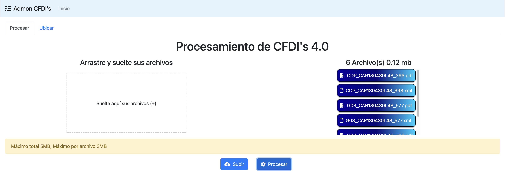
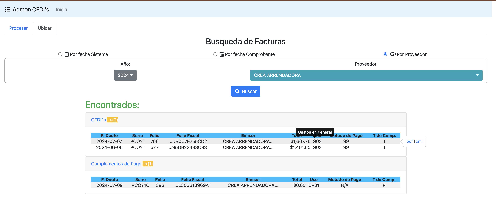

<div align="center" id="top"> 
  <!-- <a href="https://opensource.netlify.app">Demo</a> -->
</div>

<h1 align="center">Administrador de CFDI's 4.0</h1>

<p align="center">
  

  

  

  

  <!--  -->

  <!--  -->

  <!--  -->
</p>

<!-- Status -->

<!-- <h4 align="center"> 
	🚧  OpenSource 🚀 Under construction...  🚧
</h4> 

<hr> -->

<p align="center">
  <a href="#dart-about">Acerca</a> &#xa0; | &#xa0; 
  <a href="#sparkles-características">Características</a> &#xa0; | &#xa0;
  <a href="#rocket-tecnologías">Tecnologias</a> &#xa0; | &#xa0;
  <a href="#white_check_mark-requerimientos">Requerimientos</a> &#xa0; | &#xa0;
  <a href="#memo-licencia">Licencia</a> &#xa0; | &#xa0;
  <a href="https://github.com/jlpm-mex" target="_blank">Autor</a>
</p>

<br>

## :dart: Acerca 

Esta sencilla aplicación web te ayuda a ordenar y clasificar de manera conveniente los archivos pdf y xml de tus comprobantes Fiscales digitales por internet CFDI en la version 4.0.






### Instrucciones
 1) Clona el repositorio https://github.com/jlpm-mex/cfdiadmon_docker.  
```
  git clone https://github.com/jlpm-mex/cfdiadmon_docker
```
 2) Acede a la carpeta cfdiadmon_docker.  
 ```
  cd cfdiadmon_docker
```
 3) Crea las carpetas CfdiRecibidos y sus subcarpetas NoProcesados y Procesados.   
 ``` 
  mkdir -p CfdiRecibidos/NoProcesados CfdiRecibidos/Procesados
  ```
 4) Levanta los contenedores.  
```
sudo docker compose up -d
```
 5) Abre un navegador e introduce la ip de la máquina donde levantaste los contenedores, o apunta asi mismo en caso de ser la misma máquina como en el ejemplo.  
 ```
 http://localhost:9087
 ```
6) Copia y pega tus archivos PDF y XML dentro de la carpeta **NoProcesados**, la cual se encuentra dentro de la carpeta **CfdiRecibidos**.  

  > :warning: **Warning:** Los Archivos PDF y XML deben llamarse exactamente de la misma manera para que el sistema los detecte.

7) Regresa al navegador y presiona el boton procesar. 

<!--
  1. Crear carpeta para archivos de configuración en Documentos (Puede ser cualquier nombre "admon_cfdi")
  * ```mkdir ~/Documents/admon_cfdi```  
  2. Accesa a la carpeta recien creada y crea dentro de esa carpeta 2 carpetas mas (conf y data)
  * ```cd ~/Documents/admon_cfdi/```
  * ```mkdir conf```
  * ```mkdir data```
  3. 
-->

## :sparkles: Características

:heavy_check_mark: Organización de archivos xml y pdf de los CFDI  
:heavy_check_mark: Búsqueda por fecha de procesamiento
:heavy_check_mark: Búsqueda por fecha de comprobante
:heavy_check_mark: Búsqueda por nombre de emisor

## :rocket: Tecnologías 

The following tools were used in this project:

- [Java](https://www.java.com/es/)
- [Spring boot](https://spring.io/projects/spring-boot)
- [MySQL](https://www.mysql.com/)
- [Thymeleaf](https://www.thymeleaf.org/)

## :white_check_mark: Requerimientos 

- Java 8.0.352
- Mysql 8.4

## :memo: Licencia 

Este proyecto se encuentra bajo licencia del MIT. Para mas detalles, vea el archivo de  [LICENCIA](LICENSE.md).


Made with :heart: by <a href="https://github.com/jlpm-mex" target="_blank">jlpm-mex</a>

&#xa0;

<a href="#top">Back to top</a>
