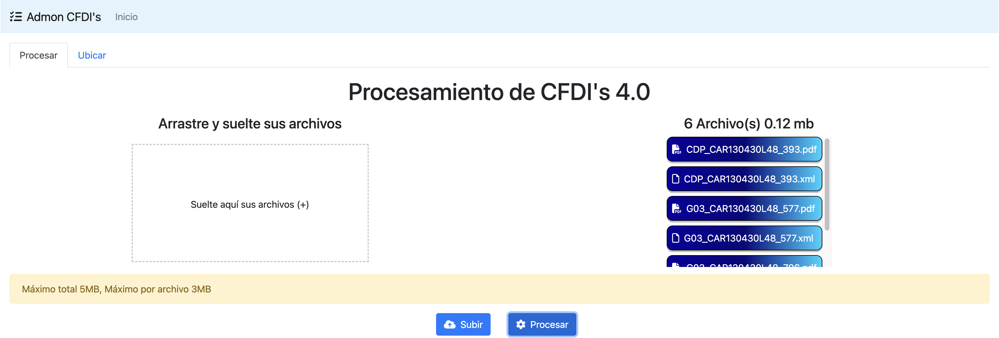
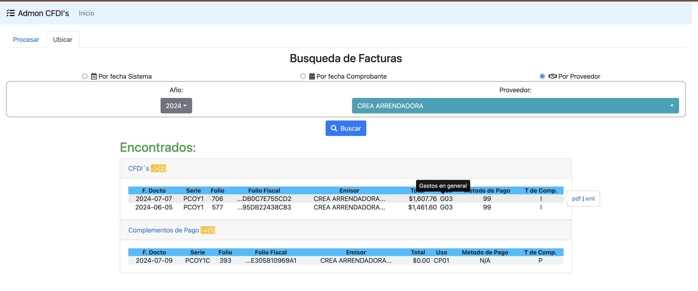
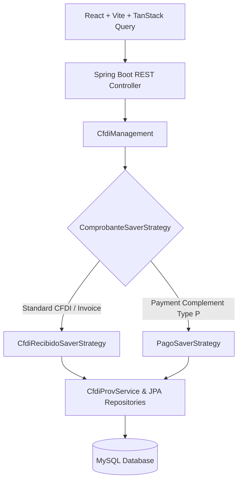

<div align="center">

# 📑 CFDI Admin

**A modern, full-stack platform for processing, organizing, and querying Mexican Digital Tax Receipts (CFDI 4.0).**

[](#) [](https://openjdk.org/projects/jdk/17/) [](https://spring.io/projects/spring-boot) [](https://react.dev/)
[](https://www.typescriptlang.org/) [](https://vitejs.dev/) [](https://tanstack.com/query) [](https://www.mysql.com/)
[](LICENSE.md)

<p align="center">
  🇪🇸 <b><a href="README.es.md">Leer esta documentación en Español</a></b>
</p>

---

<p align="center">
  <a href="#about-the-project">About</a> •
  <a href="#demo--screenshots">Screenshots</a> •
  <a href="#tech-stack">Tech Stack</a> •
  <a href="#architecture--engineering-decisions">Architecture</a> •
  <a href="#features">Features</a> •
  <a href="#getting-started">Installation</a> •
  <a href="#roadmap">Roadmap</a> •
  <a href="#license">License</a> •
  <a href="#author">Author</a>
</p>

</div>

---

## 📌 About the Project

In Mexico, **CFDI** (*Comprobante Fiscal Digital por Internet*) is the official, legally mandated electronic invoicing standard governed by the Mexican Tax Administration Service (**SAT**). Every business transaction produces standardized XML files accompanied by human-readable PDF representations, covering both standard invoices (*Ingresos/Egresos*) and payment receipts (*Complemento de Recepción de Pagos*).

Managing high volumes of CFDI files is often error-prone and tedious for accounting and administrative teams. **CFDI Admin** solves this challenge by providing an automated, resilient full-stack solution to ingest, parse, validate, categorize, and query CFDI 4.0 records efficiently.

> 🚀 **Engineering Highlight:** The project was recently re-architected and completely refactored—migrating from a legacy server-rendered Thymeleaf monolith into a clean, decoupled architecture powered by a **Java 17 / Spring Boot REST API** and a reactive **React + TypeScript SPA**.

---

## 📸 Demo / Screenshots

<div align="center">

### Main Dashboard (Ingestion & Processing)
*Drag-and-drop ingestion, pending file inspection, and batch execution status.*



<br/>

### Document Search & Filter Explorer
*Multi-criteria querying (by issue date, processing date, and supplier/RFC) with instant data grid views.*



</div>

---

## 🛠 Tech Stack

### Backend
| Technology | Role | Justification |
| :--- | :--- | :--- |
| **Java 17** | Core Platform | LTS release offering enhanced performance, strong encapsulation, and modern language features like Records and Stream enhancements. |
| **Spring Boot 3** | Application Framework | Robust dependency injection, transactional boundary management, and clean RESTful controller layer. |
| **Spring Data JPA / Hibernate** | ORM & Persistence | Declarative data access abstraction with optimized repository queries. |
| **MySQL 8** | Relational Database | Reliable transactional storage with indexing for fiscal metadata and temporal queries. |

### Frontend
| Technology | Role | Justification |
| :--- | :--- | :--- |
| **React 19** | UI Library | Component-driven, declarative architecture enabling modular user interfaces. |
| **TypeScript** | Language | End-to-end type safety, eliminating runtime errors and ensuring strict contracts with backend DTOs. |
| **Vite** | Build Tool & Bundler | Instant Hot Module Replacement (HMR) and optimized esbuild production builds. |
| **TanStack Query (React Query v5)** | Server State Management | Enterprise-grade caching, background synchronization, automatic revalidation, and loading/error state tracking. |
| **Axios** | HTTP Client | Promise-based HTTP client for transport with interceptors and upload progress monitoring. |
| **Tailwind CSS** | Styling | Utility-first CSS framework for a responsive, modern interface. |

---

## 🏗 Architecture & Engineering Decisions

### 1. Architectural Migration: From Monolith to Decoupled SPA + REST API
The application transitioned from a tightly coupled, server-rendered Thymeleaf architecture to a modern decoupled model:
- **Separation of Concerns:** The backend acts purely as a stateless RESTful business engine, while the frontend is an optimized Single-Page Application (SPA).
- **Independent Deployability & Scalability:** Backend and frontend can be containerized, scaled, and deployed independently.

### 2. Strategy Pattern (Persistence & Search Layers)
To eliminate conditional antipatterns (`if/else` branching) and adhere to the Open/Closed Principle:

- **Backend (Document Persistence in `CfdiManagement`):** When persisting parsed records, [`CfdiManagement`](file:///Users/pepe/Documents/Proyectos/Admon_CFDI/admon-cfdi-back/src/main/java/net/ellapiz/admoncfdiprov/management/CfdiManagement.java) uses a collection of [`ComprobanteSaverStrategy`](file:///Users/pepe/Documents/Proyectos/Admon_CFDI/admon-cfdi-back/src/main/java/net/ellapiz/admoncfdiprov/management/ComprobanteSaverStrategy.java) implementations. At runtime, the application evaluates the receipt type (`tipoDeComprobante`) and delegates execution to:
  - [`CfdiRecibidoSaverStrategy`](file:///Users/pepe/Documents/Proyectos/Admon_CFDI/admon-cfdi-back/src/main/java/net/ellapiz/admoncfdiprov/management/CfdiRecibidoSaverStrategy.java): Encapsulates persistence logic for standard invoices/receipts (`CfdiRecibidoVO`).
  - [`PagoSaverStrategy`](file:///Users/pepe/Documents/Proyectos/Admon_CFDI/admon-cfdi-back/src/main/java/net/ellapiz/admoncfdiprov/management/PagoSaverStrategy.java): Encapsulates persistence logic for Payment Complements (`PagoVO`, type `"P"`).
  Both strategies delegate to [`CfdiProvService`](file:///Users/pepe/Documents/Proyectos/Admon_CFDI/admon-cfdi-back/src/main/java/net/ellapiz/admoncfdiprov/service/CfdiProvService.java) and its underlying JPA repositories (`CfdiProvRepository`, `PagoProvRepository`).
- **Frontend (Dynamic API Endpoint Selection):** The frontend implements a client-side Strategy Pattern ([`SearchStrategyFactory`](file:///Users/pepe/Documents/Proyectos/Admon_CFDI/admoncfdi-web/src/services/api/documentSearchStrategy.ts)) to dynamically resolve the target REST endpoint based on the active search criteria (voucher issue date vs. system ingestion date).


```mermaid
graph TD
    A[React + Vite + TanStack Query] --> B[Spring Boot REST Controller]
    B --> C[CfdiManagement]
    C --> D{ComprobanteSaverStrategy}
    D -->|Standard CFDI / Invoice| E[CfdiRecibidoSaverStrategy]
    D -->|Payment Complement Type P| F[PagoSaverStrategy]
    E --> G[CfdiProvService & JPA Repositories]
    F --> G
    G --> H[(MySQL Database)]
```

### 3. Modern Java 17 Idioms
- **Records:** Employed for immutable Data Transfer Objects (DTOs), eliminating boilerplate and ensuring value-object semantics.
- **Streams & Functional Transformations:** Used for high-throughput XML node transformations and batch collection operations (such as dynamically filtering saver strategies with `.stream().filter(...).findFirst()`).
- **Custom Functional Interfaces & Lambdas:** Clear, testable business pipelines for document validation and file transformation rules.

### 4. Robust Server State Management (TanStack Query + Axios)
Client state management was designed with strict separation between **Client UI State** and **Server State**:
- **TanStack Query** acts as the dedicated server-state orchestrator: handling query caching, deduplication, automatic re-fetching on window focus, pagination cache warming, and asynchronous status tracking.
- **Axios** serves strictly as the HTTP transport client; TanStack Query consumes the promises returned by Axios.
- **Zero Global State Boilerplate:** By delegating server data synchronization entirely to TanStack Query, complex global state stores (such as Redux or Zustand) were deliberately omitted, keeping the client bundle lightweight and maintainable.

---

## ✨ Features

- 📁 **Automated CFDI Pairing & Organization:** Synchronizes and correlates XML and PDF companion files automatically.
- 📅 **Dual-Date Search Indexing:** Filter receipts by both *Issue Date* (*Fecha de Comprobante*) and *System Processing Date* (*Fecha de Procesamiento*).
- 🏢 **Issuer & Taxpayer Lookup:** Fast query capabilities by Issuer RFC and Legal Name.
- 📤 **Drag & Drop Upload:** Seamless file upload interface with real-time upload progress bars.
- ⚡ **Batch Directory Ingestion:** Automatic scanning and processing of files directly from local staging directories.

---

## 🚀 Getting Started

The project is fully containerized with Docker for rapid local deployment.

### Prerequisites
- [Docker](https://www.docker.com/) and [Docker Compose](https://docs.docker.com/compose/)
- Git

### Deployment Steps

1. **Clone the Docker configuration repository:**
   ```bash
   git clone https://github.com/jlpm-mex/cfdiadmon_docker.git
   cd cfdiadmon_docker
   ```

2. **Create the required file staging directories:**
   ```bash
   mkdir -p CfdiRecibidos/NoProcesados CfdiRecibidos/Procesados
   ```

3. **Start the application containers:**
   ```bash
   docker compose up -d
   ```

4. **Access the application:**
   Open your browser and navigate to:
   ```text
   http://localhost:9087
   ```

5. **Process your first batch:**
   - Drop your XML and PDF files into `CfdiRecibidos/NoProcesados` (or use the web UI drag & drop).
   > ⚠️ **Note:** Matching XML and PDF files must share the exact same base filename to be paired correctly.
   - Click the **Process** button in the dashboard.

---

## 🗺 Roadmap

- [ ] **Item-Level Concept Search:** Query and retrieve all CFDIs containing specific product/service concept descriptions.
- [ ] **AI-Powered Analytics & NLQ:** Integrate Spring AI / LLM capabilities for Natural Language Querying and Business Intelligence over invoice data.
- [ ] **Automated SAT Bulk Sync:** Direct integration with the SAT Web Service for automated bulk CFDI downloads.
- [ ] **Standalone XML Ingestion:** Support for standalone XML processing with on-the-fly PDF generation when source PDFs are unavailable.

---

## 📄 License

This project is open source and available under the [MIT License](LICENSE.md).

---

## 👤 Author

Developed by **jlpm-mex**

- GitHub: [@jlpm-mex](https://github.com/jlpm-mex)
- Source Code: [cfdiadmon](https://github.com/jlpm-mex/cfdiadmon)
- Docker Setup: [cfdiadmon_docker](https://github.com/jlpm-mex/cfdiadmon_docker)
